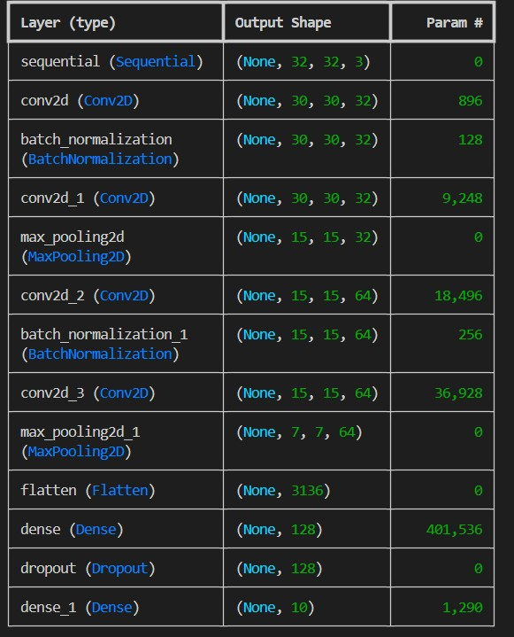

# CIFAR-10 Image Classification using a CNN (TensorFlow / Keras)

A convolutional neural network (CNN) built with TensorFlow and Keras that classifies 32x32 colour images into the 10 classes of the CIFAR-10 dataset.

## Dataset

[CIFAR-10](https://www.cs.toronto.edu/~kriz/cifar.html) contains 60,000 colour images of size 32x32 (50,000 for training and 10,000 for testing) in 10 classes:

`airplane`, `automobile`, `bird`, `cat`, `deer`, `dog`, `frog`, `horse`, `ship`, `truck`

The dataset is downloaded automatically by Keras the first time you run `train.py`, so it is not included in this repository.

## Model Overview

The model is a Sequential CNN with the following components:

- **Data augmentation:** random horizontal flip, rotation, and zoom, to help reduce overfitting
- **Convolutional layers:** four `Conv2D` layers (32, 32, 64, 64 filters, 3x3 kernels, ReLU activation)
- **Batch Normalization:** applied after selected convolutional layers
- **Max pooling:** two `MaxPooling2D` layers
- **Fully connected layer:** `Dense` layer with 128 units
- **Dropout:** rate of 0.2
- **Output layer:** `Dense` layer with 10 units and softmax activation

### Training setup

- **Optimizer:** Adam
- **Loss function:** sparse categorical cross-entropy
- **Metric:** accuracy
- **Epochs:** up to 10
- **Validation:** 20% of the training data
- **Callbacks:**
  - `EarlyStopping` stops training when validation loss stops improving
  - `ModelCheckpoint` saves the best model (by validation loss) as `best_model.keras`
  - `ReduceLROnPlateau` lowers the learning rate when validation loss stops improving

## Results

| Metric | Training | Validation | Test |
|---|---|---|---|
| Accuracy | 69.19% | 68.51% | 71.36% |
| Loss | 0.8942 | 0.9536 | 0.8541 |

Training accuracy is measured while data augmentation and dropout are active, which can make it lower than the test accuracy.

## Screenshots

### Model architecture



## Project Structure

```
.
├── train.py            # builds, trains, and evaluates the model
├── predict.py          # predicts the class of an image using the saved model
├── best_model.keras    # saved model (best validation loss)
├── images/
│   ├── model_architecture.jpg    # model architecture image used in this README
│   └── test_image.jpg      # example image for testing predictions
├── requirements.txt    # Python dependencies
├── .gitignore
└── README.md
```

## Getting Started

### 1. Clone the repository

```bash
git clone https://github.com/saiakshaya-cse/cifar10-cnn-image-classifier
cd cifar10-cnn-image-classifier
```

Replace the URL with your own repository's URL if the name is different.

### 2. Install the dependencies

```bash
pip install -r requirements.txt
```

### 3. Train and evaluate the model (optional)

```bash
python train.py
```

This trains the CNN, saves the best model to `best_model.keras`, and prints the training, validation, and test results. A saved model is already included, so you can skip this step and go straight to predictions.

### 4. Predict the class of an image

Using the included example image (`images/test_image.jpg`):

```bash
python predict.py
```

Using your own image:

```bash
python predict.py path/to/your_image.jpg
```

The script resizes the image to 32x32, loads `best_model.keras`, and prints predicted class and confidence.

## Example Prediction

`images/test_image.jpg` is a real photograph of a cat. It is **not** taken from the CIFAR-10 dataset. This image was used on purpose to see how the model behaves on a real-world photo.

| Item | Result |
|---|---|
| Actual class | cat |
| Predicted class | airplane |
| Confidence | 45.47% |

The model predicted the wrong class here. The likely reasons are:

- **Different kind of image:** the model was trained only on tiny 32x32 CIFAR-10 images. A full-size photo has to be shrunk to 32x32, so it loses detail and looks different from the training images (lighting, background, angle).
- **Limited model accuracy:** the test accuracy is 71.36%, so the model misclassifies a noticeable share of images, even from the CIFAR-10 test set.
- **Low confidence:** the confidence of 45.47% shows the model was unsure about this prediction.

This is a known limitation of small CNNs trained on CIFAR-10, and it is a good example of why real-world photos are harder than the dataset images.

## Limitations

- The model is trained only on small 32x32 CIFAR-10 images, so it may misclassify real-world photos, especially ones that differ in lighting, background, or angle from the dataset.
- It can only predict the 10 CIFAR-10 classes. Any other kind of image will still be assigned to one of those classes.

## Possible Improvements

- Try transfer learning with a pretrained model such as MobileNetV2
- Add training curves and a confusion matrix
- Build a simple web demo with Streamlit or Gradio

## Tech Stack

Python, TensorFlow, Keras, NumPy, Pillow

## Author

M. Sai Akshaya, [GitHub](https://github.com/saiakshaya-cse)
